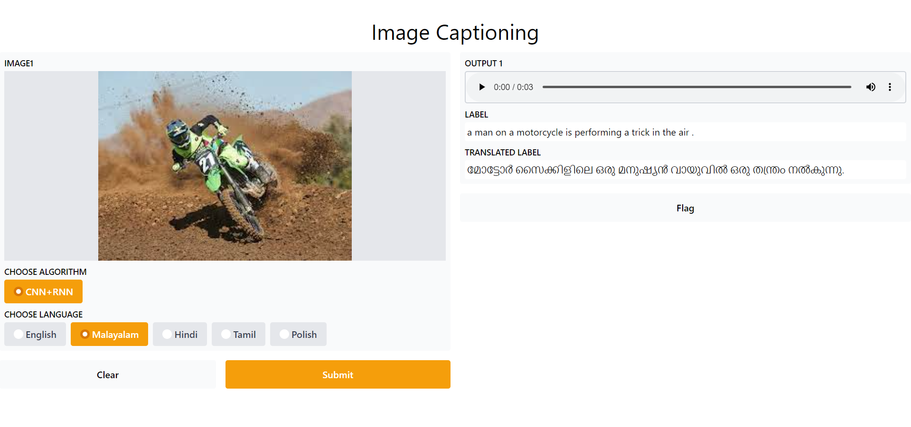

# Image-Captioning-with-Deep-Learning-and-NLP
An image captioning model that uses flickr8k dataset with Deep learning and NLP

Reference : -> https://arxiv.org/abs/1502.03044

Required files to Run complete basic model:
runs/flickr
test_examples
Metrics.ipynb
get_loader.py
model.py
test.ipynb
train.ipynb
webcam_test.ipynb
flickr8k
my_checkpoint.pth.tar
image-captioning-model.pth
flikr8k/images/
flikr8k/captions.txt

Download the dataset used: https://www.kaggle.com/dataset/e1cd22253a9b23b073794872bf565648ddbe4f17e7fa9e74766ad3707141adeb Then set images folder, captions.txt inside a folder Flickr8k.

This repo containes many models. To run the basic one with our gradio application download the files from:
https://drive.google.com/drive/folders/1ThbT5oBHeZ83TyUisJUe9KRyfW2q9aJj

Steps:

1. Run webcam_test.ipynb to test webcame and test.ipynb to upload caption and test.

Working:

